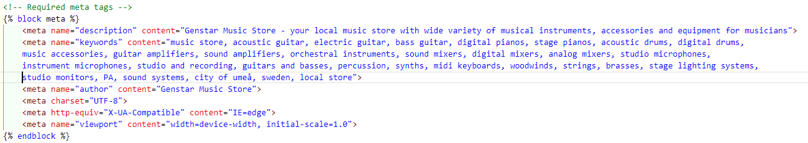

Desktop | Mobile |
--- | --- |
 |  |


# Genstar Music Store

Genstar Music Store (later in a document just GMS for better use) is a musical instrument store, where customers can but different musical instruments from most famous brands online. There is also a big variety of other tools for producers, sound engineers and stage technicians for recording, live performances and lighting on stage or other places. 

GMS allows customers to buy instruments online and get them delivered by 3-5 days. Customers can buy anonymously or with created account. Creating account gives customers preferences, such as wishlist, saving data for future purchases and my profile page with orders history.  

You can visit the deployed website here - [Genstar Music Store](https://genstar-music-store-3a732f4aac46.herokuapp.com/products/).

GitHub repository you can find here - [GitHub repo](https://github.com/GenaGrig/eCommerce-pp5.git).

## Table of contents

1. [User Experience (UX)](#user-experience-ux)
    1. [Strategy](#strategy)
        1. [Project Goals](#project-goals)
        2. [User Stories](#user-stories)
        3. [Strategy Table](#strategy-table)
    2. [Scope](#scope)
    3. [Structure](#structure)
    4. [Surface](#surface)
2. [Features](#features)
    1. [Main features](#main-features)
    2. [Products Page](#products-page)
    3. [Product Details Page](#product-details-page)
    4. [Breadcrumbs and Categories Page](#breadcrumbs-and-categories-page)
    5. [Shopping Cart Page](#shopping-cart-page)
    6. [Checkout Page](#checkout-page)
    7. [Order Confirmation Page](#order-confirmation-page)
    7. [Profile Pages](#profile-pages)
    8. [Wishlist](#wishlist)
    9. [Product Management Page](#product-management-page)
    10. [Authentication Pages](#authentication-pages)
3. [Technologies Used](#technologies-used)
    1. [Languages Used](#languages-used)
    2. [Libraries and Frameworks](#languages-and-frameworks)
    3. [Packages / Dependencies Installed](#packages--dependencies-installed)
    4. [Database Management](#database-management)
    5. [Tools and Programs](#tools-and-programs)
4. [Testing](#testing)
    1. [Go to TESTING.md](https://github.com/GenaGrig/eCommerce-pp5/blob/main/TESTING.md)
5. [Marketing](#marketing)
6. [Deployment](#deployment)
7. [Credits](#credits)
8. [Known Bugs](#known-bugs)
9. [Acknowledgements](#acknowledgements)

***

# User Experience (UX)

### Strategy

#### Project goals

* Website uses modern techniques and frameworks to be attractive to user
* Color palette and contrast is used in such way that site elements do not stick out or disappear behind
* Responsive design makes the website accessible on different devices and screen sizes
* Navigation panel is easy to use and navigate, names and categories are descriptive
* Structure of website is easy to understand and navigate
* Site users are able to register an account to use extra services
* Site users are able to login to their accounts to use extra services
* Site users are able to logout from their accounts to secure their private information and order details
* Site admins can add, edit or delete products both from admin panel and via user interface on product management page
* Site users are able to edit their profiles after creating account and save personal info if they wish
* Site users can leave ratings to products they purchase (login required)
* Site users has their own wishlist to save products they want to buy (login required)
* Site users has their own profile page with personal information, wishlist and orders history (login required)
* Website uses pop-up messages that follows actions made by the users

#### User Stories

* As a Shopper, I can view list of products so that I can select some to purchase
* As a Shopper, I can view individual product details so that I can identify the price, description, product rating and product image
* As a Shopper, I can identify deals, special offers and discounts so that I can take advantage of special sales for purchasing
* As a Shopper, I can easily view the total of my purchases at any time so that I will not spend too much or add more items to my cart to reach my budget
* As a Site User, I can easily register and account so that have a personal account to view my profile and have access to extra features
* As a Site User, I can login or logout to/from site so that I can access my personal account information
* As a Site User, I can recover my password in case I forget it so that I can recover access to my account
* As a Site User, I can receive confirmation email after new account registering so that I can verify that my account registration was successful
* As a Site User, I can have personalized user profile so that I can view my order history, order confirmations and save my payment and shipping information
* As a Shopper, I can sort the list of all available products so that I can identify the best rated, best priced and categorically sorted products
* As a Shopper, I can sort specific category of product so that I can find best-rated, best-priced product in specific category, or sort the products by name in specific category
* As a Shopper, I can sort multiple categories of products simultaneously so that I can find the best-priced or best-rated products across broad categories
* As a Shopper, I can search for a product by name or description so that I can find a specific product I would like to purchase
* As a Shopper, I can easily see what I have searched for and the number of results so that I can quickly decide whether the product I want is available
* As a Shopper, I can select quantity of a product when purchasing it so that I can ensure I do not accidentally select the wrong product quantity
* As a Shopper, I can view items in my basket to be purchased so that I can identify the total cost of my purchase and all items I will receive
* As a Shopper, I can adjust the quantity of individual items in my bag so that I can easily make changes to my purchase before checkout
* As a Shopper, I can easily enter my payment information so that check out quickly and with no difficulties
* As a Shopper, I can feel my personal and payment information is safe and secure so that I can confidently provide the needed information to make a purchase
* As a Shopper, I can view an order confirmation after checkout so that I can verify that I have not made any mistakes when purchased products
* As a Shopper, I can receive an order confirmation email after checking out so that I can keep the confirmation of what I have purchased for my records and order following
* As a Store Owner, I can add a product so that I can add new items to store
* As a Store Owner, I can edit/update a product so that I can change product prices, descriptions, images and other product criteria
* As a Store Owner, I can delete a product so that I can remove items that are no longer for sale/out of stock
* As a Site User, I can add my personal profile image so that I can click it instead and open my profile menu
* As a Site User, I can sign in using social networks so that I can have multiple choices for signing in from different platforms
* As a Shopper, I can see real number of desired product in stock so that I am sure my product is available and I can order it right now

At the start of the project user stories looked like this:


### Week 1


### Week 2


### Week 3


### Week 4


### Finals


### Extra features - undone


#### Strategy Table

Opportunity / Problem | Importance | Viability / Feasibility
--- | --- | ---
Responsive design | 5 | 5
Account registration | 5 | 5
Social media signup | 1 | 0
Profile page | 5 | 5
Profile image | 1 | 0
Wishlist | 4 | 4
Add, edit and delete products| 5 | 5
Ability to search/filter for products | 4 | 3
Special offers | 3 | 2
Order payment and confirmation | 5 | 5
**Total** | **38** | **34**

### Scope

Based on strategy table, not all the features will be implemented in the first deployment of the project and some of the features will not be implemented at all, because of their difficulties or its necessity at this stage. The main goal was to make a MVP (minimum viable product), so the user can have fully functional web site and make all the necessary manipulations mentioned in user stories.

#### Features that will not be implemented at this stage
* Social media signup
* Profile image
* Special offers and discounts
* Coupons

### Skeleton

#### Wireframes

[Balsamiq](https://balsamiq.com/) has been used to display the appearance of the site and display the placement of the different elements within the pages.

Page | Desktop Version | Mobile Version
--- | --- | ---
Main products page |  | 
Product details |  | 
Wishlist page / User must be authenticated |  | 
Shopping cart |  | 
Checkout page |  | 
Profile page / User must be authenticated  |  | 
Profile page / Orders History |  | 
Profile page / My Wishlist |  | 
Profile page / Profile settings |  | 
Product management pages, Add/Edit Product / Only for staff members |  | 
Login page |  | 
Register page |  | 
Logout page / User signed in |  | 

### Structure

#### Database Model
The database model has been designed using [Lucidchart](https://www.lucidchart.com/).


### Surface

#### Color palette

Color scheme of blue violet(#8A2BE2) were used for titles, button backgrounds and as main color for website. To the contrast white color(#ffffff) was used and the combination of blue violet and white creates mild color palette for customer eyes to make the UI and UX smoother. Grey color was used only for navigation bar and footer. It looks mild and does not have problems with contrast or other colors used.


#### Fonts

[Playfair Display](https://fonts.google.com/?query=playfair+display) font from Google Fonts was used on a website for some titles. Other fonts are base Bootstrap fonts.

[Back to top ⇧](#genstar-music-store)

# Features

### Main features

The website is made using the responsive design in mind, as not only desktop PC or laptop users will be visiting it. Website runs smoothly on tablets and phones as well and supports different screen sizes.

The website is done as a classical e-commerce store with products on main page and all necessary information on each product card. Below I will go through main website elements in details.

#### Header with not authenticated user


Header with no authenticated user consist of three main parts:

* Logo, clickable, that returns customer to main page
* Search bar, where customer can search products or categories
* Two icons/buttons - My Account with Login and Register buttons in dropdown menu; and Cart button which show sum of products already in cart, quantity of products in cart and if clicked move customer to current cart.

#### Header when user is authenticated


Header when user is authenticated differs, consist of three main parts, but has more elements:

* Logo, clickable, that returns customer to main page
* Search bar, where customer can search products or categories
* Three icons/buttons: 
    - My Account with dropdown, where if user is administrator, store owner or staff member there is a Product Management button, for adding, editing or deleting product. Otherwise, there is just a My Profile and Logout buttons.
    - Wishlist button that leads customer to its wishlist.
    - Cart button which show sum of products already in cart, quantity of products in cart and if clicked move customer to current cart.

#### Navigation bar

Navigation bar is presented as a categories list in closed state and with mouse over it opens with sub-categories for each parent category.

* Main navigation bar in closed state


* Main navigation bar in opened state


Navigation bar does not change if the user is logged in or logged out, it contains only information about products.

#### Footer


Footer has three main areas:
- area with grey background where Subscription form to newsletters is located on the left and social media buttons on the right
- main area with logo and different links grouped by categories. Right now, not all links are clickable, because it is not suitable for MVP, and will take a huge amount of extra time to fix all links working, and filled with respective information. Down on the right customer can find language selector and back to top button. Language selector is a future feature to be implemented if the website will become international.

#### Toasts and other helpful messages

Toasts working as flash messages that supports most of users' actions and are quite flexible for containing different information and display success, warning or error messages.

* Simple success toast to show customer successful sign in. 


* In this toast, I added buttons for customer to view its cart to edit it or go directly to checkout.


### Mobile menu

Each menu category has is a dropdown, containing sub-categories related to its parent category.

Menu without authentication | Menu with authentication |
--- | --- |
 |  |


[Back to top ⇧](#genstar-music-store)

### Products Page
Desktop | Mobile |
--- | --- |
 |  |

Main page has first major element below the menu that is carousel that contains slides with photos that are an advertising of featured music products and campaigns that is going on now. Changing of slides is automatic each 5 seconds, with stop when mouse is over slide.

Second element is a category list below the carousel. These are parent categories for products related to them. Clicking on a respective category, customer will see the page, containing all the products in the sub-categories related to parent category.

Below category list customer will see all the product cards that are existing on a website. They are sorted by name by default, but customer can choose his own way of sorting with help of sort option element on the top left of products list. Sorting options are various and has both ascending and descending view. 

Each product card contains general information about product such as product photo, product name, product price, add to wishlist icon (only if user is authenticated), product rating (based on customer ratings), real-time quantity in stock, product category and product sku number. 

Desktop | Mobile |
--- | --- |
 |  |

### Product Details Page


#### Mobile view of product details page

Mobile view part 1 | Mobile view part 2 | Mobile view part 3 |
--- | --- | --- |
 |  |  |

Product details page has several elements that is worth to describe in details:

* Big photo of product that enlarges and opens in new tab by clicking on it.
    - As a future feature a gallery of photos can be made, to show to customer more angles of product and even featured videos about product. It is not implemented due to lack of knowledge on how to make it and shortage of time.
* Product name
* Average rating that is calculated based on customer product rating. It shows "No Rating" in case there are no customer ratings on a product. 
* Quantity in stock (right of average rating in green color) shows real-time quantity in stock. This number decreases if other customers make purchases of relative product and updates with page refresh. Product quantities can be changed manually by staff members and administrators both in front-end on product management page, clicking the "Edit Product" button on product details page or in back-end in admin panel. 
* Price shows product price in euro.
* Short features of a product and some general information such as type of product, color, material and brand.
* Rate the product is a working option, by which customers can leave their rating to products they purchased. Based on customer ratings average rating is calculated and shown below product name and on the main products page. 
* Only when user is authenticated as a staff member or administrator two buttons - Edit Product and Delete Product is shown. If customer is not a member of these groups, this buttons are hidden and not accessible via address bar as well. So site users cannot add, edit or delete products using address bar, they will get the error that just site owners can do that. 


* Quantity change element, by which customer can change quantity of a product and add it to cart then
* Three buttons:
    - Continue shopping - that return customer to main products page
    - Add to cart - that adds desired quantity of products to cart
    - Save button - adds product to wishlist, only when user is authenticated. Otherwise, this button is hidden.
* Full description of product features.

### Breadcrumbs and Categories Page

#### Breadcrumbs

Desktop | Mobile |
--- | --- |
 |  |

Breadcrumbs are used to make both UI and UX more attractive and intuitive to customers. Instead of going through menu or main products page, customer can click on respective breadcrumb and see all the products in related category. 

#### Categories

Desktop | Mobile |
--- | --- |
 |  |

Categories has same function as breadcrumbs, combining all product of parent categories together. Customer can select just acoustic guitar category to see only acoustic guitars in it or select acoustic guitar products category, that contains all sub-categories in parent category Acoustic Guitars including amplifiers and accessories. This is of course a bonus option, but in my mind, it is better for both UI and UX. 

### Shopping Cart Page
Desktop | Mobile view 1 | Mobile view 2 |
--- | --- | --- |
 |  |  |

Shopping Cart Page displays list of products that customer added to it. It contains several elements that is worth to mention in details:
- Product name and category as links, so customer can click them and watch again respective product or category
- Quantity input field and Update Cart button. In case customer would change his mind and increase or decrease quantity of a product in cart, this field would help. Changing the quantity and clicking Update Cart button updates cart, cart total, tax and grand total values. Changing quantity of a product will change the total product price and shows price per item.
 |
* Remove button - removes product from cart
* Value display on the right with Cart Total (with taxes), taxes separately (25%), delivery cost (if the cart total less than 100 euros) and grand total, a sum of cart total and delivery cost.
* One button to Proceed to Checkout that leads to Checkout Page and second button to Continue Shopping that redirects to main products page.

### Checkout Page
Desktop | Mobile view 1 | Mobile view 2 | Mobile view 3 |
--- | --- | --- | --- |
 |  |  |  |

Checkout page contains form which customer must fill with personal details, shipping info and payment card information. Customer can check everything one more time and click Complete Order. This action completed order and if everything is filled correctly redirects to Order Confirmation page, otherwise page displays the error, what is missed and needs to be filled in or changed. 

* Coupons is a future option. There were tries to implement this function, but they were unsuccessful and it was decided to leave this feature undone at this stage of website implementation. 

#### Terms of Use

This section is necessary, because e-commerce website needs to protect its rights on a website and information its contains. The first document 'Terms and Conditions' contains general rules and regulations for the use of Genstar Music Store website. By accessing the website user accepts terms and conditions automatically, otherwise user needs to leave website. Link to this section is located below Payment card details.

Privacy Policy/GDPR is a document that secures visitors privacy. As the website collects and stores users information, this document provides description of which information is collected and how it is used. Link to this section is located below Payment card details.

#### Terms and Conditions and Privacy Policy/GDPR
Desktop | Mobile |
--- | --- |
 |  |

### Order Confirmation Page
Desktop | Mobile view 1 | Mobile view 2 | Mobile view 3 |
--- | --- | --- | --- |
 |  |  |  |

Order Confirmation Page contains all the information about the order, such as order number, order details with products ordered and customer information. An order confirmation email was sent to customer provided email. 

### Profile pages

#### Profile page main
Desktop | Mobile |
--- | --- |
 |  |

User profile page consists of four links to pages that summarize user information and actions on website.

* Profile main page has general information about customer. Before first purchase or when the customer has not entered any personal information or unchecked "save info" before order confirmation, all fields are empty and the value is None. After customer made first purchase with personal information entered and 'save info' box checked, values in respective fields would be filled out with information given. Customer can change personal information in Profile setting tab. 

* Below the personal information customer can find Latest 3 orders. This is limited for customer UX to not overflow the profile page. If the customer wants to see all orders made, there is a button "View all orders" that redirects to orders history tab with all orders available. Customer has an option to delete an order in case he received it or canceled. By clicking Order ID link, customer can open Order Confirmation page. 

On each page in profile tab, customer can opens other tabs in the menu on the left.

Log Out link in the end of Profile pages menu redirect customer to log out page. 

#### Orders History page
Desktop | Mobile view 1 | Mobile view 2 |
--- | --- | --- |
 |  |  |


* Orders history tab contains all orders made by customer with exactly the same layout as on main profile page but without any view limit. 

#### My Wishlist page
Desktop | Mobile |
--- | --- |
 |  |

* My Wishlist page has the same functionality and view as Wishlist in the main website. It is made for ease of use for customer to check which products are in Wishlist without need to go back from Profile pages. 

#### Profile settings
Desktop | Mobile |
--- | --- |
 |  |

* Profile setting is a page where customer can update personal information. It can be filled after account creation or edited after first completed order. Saved information entered in order form is displayed here. Only fields that was filled in will be displayed, non-filled fields will have value of None. 

### Wishlist
Desktop | Mobile |
--- | --- |
 |  |

* Wishlist page displays products that customer saved clicking the heart on product card on main products page or clicking the Save button on product details page. From wishlist page customer can add saved products to cart or remove products from Wishlist by clicking respective buttons. 

### Product Management Pages

#### Add Product page
Desktop view 1 | Desktop view 2 |
--- | --- |
 |  |

Mobile view 1 | Mobile view 2 |
--- | --- |
 |  |

Add product page is accessible via link in My Account - Product Management and let site owners, administrators or staff members who has rights add products to ecommerce website. It is not necessary to fill in all fields, but there are required filed that needs to be filled to add product successfully. For customer service, it is better to fill as much information as possible. 

It can be easier to add new product via admin panel, because it has Summernote editor for easier editing of description of product. 

 |

#### Edit Product page
Desktop view 1 | Desktop view 2 |
--- | --- |
 |  |

Mobile view 1 | Mobile view 2 |
--- | --- |
 |  |

Edit product page is accessible via button on Product Detail page or admin panel. It has the same functionality as Add Product page, with the only difference that information about product is already filled in. If admins will change any information about product, they just need to change it and click in Edit Product button below, otherwise click Cancel to discard changes. 

Products can be edited via admin panel with help of Summernote editor.
 |

From this page, Quantity in Stock is available, and admins can change stock values directly from the front-end, otherwise this option is available at back-end in admin panel as well.

#### Delete Product

Deleting Product option is accessible via admin panel or Product Detail page by clicking "Delete Product" button. As future option, a confirmation modal can be made to prevent admins for deleting product unintentionally. 

### Authentication pages

#### Register New Account

Desktop | Mobile |
--- | --- |
 |  |

Register New Account form contains three required fields that should be filled to register new user. Each field has a little description below, to help the user enter correct information and avoid mistakes. After this procedure, user is available to log in to website at any time. After registration, user will get email with confirmation link, that user will need to click on to verify registration email (disabled in this deployed version). Registered users will have access to Profile pages, Wishlist and save personal information for orders.

#### Sign In page

Desktop | Mobile |
--- | --- |
 |  |

Sign In page has just to field to be filled as Username and Password, which user entered when registered new account. There is a checkbox "Remember me" to store user information as cookie. Below that, a "Forgot password" link redirects user to a password reset page, where user needs to enter email address and get a link to change password. 

#### Sign Out

Desktop | Mobile |
--- | --- |
 |  |

Sign Out page is quite simple and contains only one button - "Sign Out". At this stage, action can be reverted and user can go back to other pages without signing out. As a future feature, this page can be changed to modal with the same functionality.

### Future features

Ecommerce website can be upgraded with many features, but to the lack of time and knowledge, not all of them were implemented now:

* Special offers, deals and discount products. This can be implemented by adding extra category to product model and selecting it in product description.
* Profile image. Extra feature just to make UI more attractive. This feature is not commonly used on ecommerce websites.
* Sign in with social networks. This feature is quite popular and save time for customer on registering. Due to the lack of time and knowledge, it was not implemented now, but can be done in future updates.
* Coupons. Quite popular feature on ecommerce websites. There were tries to implement this feature in this deployment, but they were not successful. This feature will definitely be implemented in future updates.
* More products. In this deployment, main goal was to make MVP website, and that is why only 51 product was added. In future updates this amount can be increased if needed.
* Footer. Right now links in the footer are decorative and does not redirect to respective pages. Due to the lack of time, they were not filled with appropriate information. In future updates these pages can be made to functional.
* Delete products button. As I mentioned in relative section, confirmation modal can be made in future updates to avoid unintentional delete of product. 
* Profile setting page should have option to change password. This can be done in future updates.
* Sign out function as a modal, to skip the separate sign out page.
* Customer can change their previous rating value to products. 

[Back to top ⇧](#genstar-fitness)

# Technologies Used

### Languages Used

* [HTML5](https://en.wikipedia.org/wiki/HTML)
* [CSS3](https://en.wikipedia.org/wiki/CSS)
* [JavaScript](https://en.wikipedia.org/wiki/JavaScript)
* [Python](https://en.wikipedia.org/wiki/Python_(programming_language))


### Libraries and Frameworks

* [Django](https://www.djangoproject.com/)   
    * Django was used as web framework.
   
* [Bootstrap 5](https://getbootstrap.com/)  
    * Bootstrap 5 was used throughout the website to help with styling and responsiveness.

* [Font Awesome](https://fontawesome.com)  
    * Font Awesome was used throughout the website to add icons for aesthetic and UX purposes. 


### Packages / Dependencies Installed

* [Django Allauth](https://django-allauth.readthedocs.io/en/latest/)  
    * Django Allauth was used for user authentication, registration, and account management.

* [Django Crispy Form](https://django-crispy-forms.readthedocs.io/en/latest/)   
    * Django Crispy Form was used to control the rendering of the forms. 
 
* [Gunicorn](https://gunicorn.org/)  
    * Gunicorn was used as Python WSGI HTTP Server for UNIX to support the deployment of Django application.  

* [AWS](https://aws.amazon.com)
    * Amazon Web Services has been used as static and media files storage management solution

* [Summernote](https://summernote.org/)
    * Sumemrnote has been used as admin panel editor for adding or editing products short and full description.

### Database Management
* [ElephantSQL](https://www.elephantsql.com/)   
    * ElephantSQL as a Service database was used in production, as a service based on PostgreSQL.


### Tools and Programs

* [Git](https://git-scm.com)  
    * Git was used for version control by utilizing the Gitpod terminal to commit to Git and Push to GitHub. 

* [GitPod](https://gitpod.io/)
     * GitPod was used for writing code, committing, and then pushing to GitHub.

* [GitHub](https://github.com)  
    * GitHub was used to store the projects code after being pushed from Git. 

* [Heroku](https://www.heroku.com)   
    * Heroku was used to deploy the website.

* [Coolors](https://coolors.co)  
    * Coolors was used to create a color scheme for the website.

* [Chrome DevTools](https://developer.chrome.com/docs/devtools/)
    * Chrome DevTools was used during development process for code review and to test responsiveness.

* [W3C Markup Validator](https://validator.w3.org/)
    * W3C Markup Validator was used to validate the HTML code.

* [W3C CSS Validator](https://jigsaw.w3.org/css-validator/)
    * W3C CSS Validator was used to validate the CSS code.

* [JSHint](https://jshint.com/) 
    * The JSHints JavaScript Code Quality Tool was used to validate the site's JavaScript code.

* [Terms and Conditions generator](https://www.termsandconditionsgenerator.com)
    * Terms and Conditions generator was used to create an agreement between website and user for protection of GenStar Fitness website rights

* [Privacy Policy generator](https://www.termsfeed.com/privacy-policy-generator/)
    * Privacy Policy generator was used to create a document describing which information GenStar Fitness website collects and stores and how it secures users privacy

[Back to top ⇧](#genstar-music-store)

# Testing

The testing is available in separate file [TESTING.md](https://github.com/GenaGrig/eCommerce-pp5/blob/main/TESTING.md)

# Marketing

### Facebook business page

Facebook business page was created for marketing purposes. For more divertisement in future can be created Instagram and X(Twitter) accounts. YouTube can be used more for storing product previews.

Facebook page main | FB page view 1 | FB page view 2 |
--- | --- | --- |
 |  |  |

### Newsletter

Newsletter subscription form is located in the top of the footer and has an email input and subscribe button. By entering email and clicking subscribe button customer adds email address to database which will be used as recipients list for future newsletters. 

 |

### Business Model and Marketing Strategies

* Genstar Music Store (GMS) is an e-commerce retail store that provides a wide choice of musical instruments, accessories and other tools and equipment related to music. 
* Customers are both private persons and businesses that are in need of musical instruments, accessories and other equipment. All the products provided in store can be used for home or professional use, depending on customer needs. 
* Products in music store can be specified or wide ranged. GMS has wide range of products and provides musical instruments for every need, stage lighting systems, sound systems for clubs or smaller locations, recording devices and equipment for big and small studios for both professional and amateur use and a lot more. Price range is very wide and depends mostly on needs of customer.
* Payment system on a website at the moment is a credit card, but in future implementations can be expanded and complemented with other payment options.
* Business model is both B2C and B2B as GMS products are suitable for both private customers and businesses like music clubs, official and signed bands, orchestras etc.

#### Marketing Strategies

* Search Engine Optimization - implemented in meta tags and keywords on a website.
* Social media marketing - Facebook business page. Can be diversified with creating Instagram and X(Twitter) accounts for marketing purposes such as advertising, hot deals and special offers.
* Email marketing - Subscription option for customers that provides newsletters with later deals, discounts and many other information. Implemented on website.
* Paid advertising. Can be implemented to view music store first at searching results for musical instruments on search websites. 

### Search Engine Optimisation (SEO)

Genstar Music Store is a music instruments website. It has a big meta block with all required information in base.html page that is extended all over the website. Keywords are used as a SEO for better searching of website.



SEO in HTML on a website is implemented only in navigation bar and headers on each page. All other titles and names visible on a front-end is written in html as Django tag for ease of use. All the product names, information and descriptions are stored in database. Images as well are stored in cloud services and has no alternative attributes written in the html code. 

XML-sitemap and robots.txt are presented for this website in the root of the project.

# Deployment

This project was developed using a [GitPod](https://gitpod.io/) workspace. The code was committed to [Git](https://git-scm.com/) and pushed to [GitHub](https://github.com/") using the terminal.

### Deploying on Heroku
To deploy this page to Heroku from its GitHub repository, the following steps were taken:

1. Create the Heroku App:
    - Select "Create new app" in Heroku.
    - Choose a name for your app and select the location.

2. Attach the Postgres database:
    - Open [ElephantSQL](https://www.elephantsql.com/) website and create free account
    - Click on green button Create New Instance
    - Select Name of the project and plan Tiny Turtle (Free), click on continue
    - Select your region, click on Review
    - Check all information and click on Create instance
    - Click on your instance in the list to open its details
    - Copy database URL in URL field
    - Open your Heroku project
    - Open Settings tab and click on Reveal Config Vars
    - In a field Key add DATABASE_URL
    - In a field VALUE add postgres URL from ElephantSql created instance
    - Click on ADD to finish the process

3. Prepare the environment and settings.py file:
    * In the Settings tab, click on Reveal Config Vars and copy the URL next to DATABASE_URL.
    * In your GitPod workspace, create an env.py file in the main directory. 
    * Add the DATABASE_URL value and your chosen SECRET_KEY value to the env.py file.
    * Add the SECRET_KEY value to the Config Vars in Heroku.
    * Update the settings.py file to import the env file and add the SECRETKEY and DATABASE_URL file paths.
    * Update the Config Vars with the Cloudinary URL, adding into the settings.py file also.
    * In settings.py add the following sections:
        * Cloudinary to the INSTALLED_APPS list
        * STATICFILE_STORAGE
        * STATICFILES_DIRS
        * STATIC_ROOT
        * MEDIA_URL
        * DEFAULT_FILE_STORAGE
        * TEMPLATES_DIR
        * Update DIRS in TEMPLATES with TEMPLATES_DIR
        * Update ALLOWED_HOSTS with ['app_name.heroku.com', 'localhost']

4. Store Static and Media files in Cloudinary and Deploy to Heroku:
    - Create three directories in the main directory: media, static and templates.
    - Create a file named "Procfile" in the main directory and add the following:
        - web: gunicorn project-name.wsgi
    - Go to Deploy tab on Heroku and connect to the GitHub, then to the required repository.
    Click on Deploy Branch and wait for the build to load. When the build is complete, the app can be opened through Heroku.

### Forking the Repository
By forking the GitHub Repository, we make a copy of the original repository on our GitHub account to view and/or make changes without affecting the original repository by using the following steps...

1. Log into [GitHub](https://github.com/login) or [create an account](https://github.com/join).
2. Locate the [GitHub Repository](https://github.com/GenaGrig/genstar-fitness.git).
3. At the top of the repository, on the right side of the page, select "Fork"
4. You should now have a copy of the original repository in your GitHub account.

### Creating a Clone
How to run this project locally:
1. Install the [GitPod Browser](https://www.gitpod.io/docs/browser-extension/ "Link to Gitpod Browser extension download") Extension for Chrome.
2. After installation, restart the browser.
3. Log into [GitHub](https://github.com/login "Link to GitHub login page") or [create an account](https://github.com/join "Link to GitHub create account page").
2. Locate the [GitHub Repository](https://github.com/GenaGrig/genstar-fitness.git).
5. Click the green "GitPod" button in the top right corner of the repository.
This will trigger a new GitPod workspace to be created from the code in GitHub where you can work locally.

How to run this project within a local IDE, such as VSCode:

1. Log into [GitHub](https://github.com/login) or [create an account](https://github.com/join).
2. Locate the [GitHub Repository](https://github.com/GenaGrig/eCommerce-pp5.git).
3. Under the repository name, click "Clone or download".
4. In the Clone with HTTPs section, copy the clone URL for the repository.
5. In your local IDE, open the terminal.
6. Change the current working directory to the location where you want the cloned directory to be made.
7. Type 'git clone', and then paste the URL you copied in Step 3.
```
git clone https://github.com/GenaGrig/eCommerce-pp5.git
```
8. Press Enter. Your local clone will be created.

Further reading and troubleshooting on cloning a repository from GitHub [here](https://docs.github.com/en/free-pro-team@latest/github/creating-cloning-and-archiving-repositories/cloning-a-repository)

[Back to top ⇧](#genstar-music-store)

# Credits

This resources were used as a help to create [GenStar Music Store](https://genstar-music-store-3a732f4aac46.herokuapp.com/products/) website:

### Content
* Website content was written by the developer
* README file was written with help of following documents:
    * Code Institute [README template](https://github.com/Code-Institute-Solutions/readme-template)
    * GitHubs [Basic writing and formatting syntax](https://docs.github.com/ru/get-started/writing-on-github/getting-started-with-writing-and-formatting-on-github/basic-writing-and-formatting-syntax#headings)
    * Hints and some structure of README files from existing projects from other CI students
    * [josswe26 code-buddy project readme](https://github.com/josswe26/code-buddy.git) as a perfect example how readme file should look like. Some parts were taken from this Readme file.
    * [Genstar Fitness project readme](https://github.com/GenaGrig/genstar-fitness/blob/main/README.md) file from previous project that was updated and filled with more parts to describe this project in more details.

### Media

* [ChatGTP](https://chat.openai.com) - very useful tool for implementing different features and models, that was not covered in course. Adaptation of code was required every time, as nothing worked from scratch by just copy-paste. Useful to understand what each function and line of code does before implementing the code. Many problems were solved by help of ChatGTP with understanding were the error was. 
* [Gear4Music music store](https://www.gear4music.com) - all information about products (photos, description of products) were taken here. Idea of carousel and images were taken from this website as well. 
* [Bootstrap eCommerce free templates & themes](https://bootstrap-ecommerce.com) - a collection of free E-commerce website page templates. Ideas for design and layout of main products page, product details page, shopping cart page, checkout page and user account page was taken here. Code parts and layout of above mentioned pages were taken here and adapted for my website.
* [W3Schools Mega Menu](https://www.w3schools.com/howto/howto_css_mega_menu.asp) - Mega Menu for my website was taken here and adapted for website needs
* [Bootstrap Offcanvas mobile navigation bar](https://getbootstrap.com/docs/5.3/components/navbar/#offcanvas) - offcanvas navigation bar for mobile devices was taken here and adapted for website needs
* [BoutiqueAdo tutorial project by Code Institute](https://github.com/Code-Institute-Solutions/boutique_ado_v1.git) - code parts, models and ideas from this tutorial project were adapted and used in Genstar Music Store website code

### Code

* [Code Institutes' Slack channel](www.slack.com) was used to get help from its students in resolving code problems and questions
* [Bootstrap 5](https://getbootstrap.com/) website was used very often to fix the problems with different elements and get responsive design work
* Some of code functions was written with help of [GitHub Copilot](https://github.com/features/copilot)

[Back to top ⇧](#genstar-music-store)

# Known Bugs

* Sending emails function was disabled due to unknown bug from Gmail, that requires some form of user authentication and smtp server error. Everything was made by Gmail tutorials with creating app password and 2-step verification, but still the same error was displayed every time email should be send. No solution was found.
 |

# Acknowledgements

* I want to thank my mentor Marcel Mulders for very good feedback and very useful advices that made my project complete and interesting. Very good ideas from my mentor that was implemented and made project look more solid.
* I want to thank members in our Code Institute Slack community for giving feedback and showing their own projects that was inspiring in different ways.

[Back to top ⇧](#genstar-music-store)